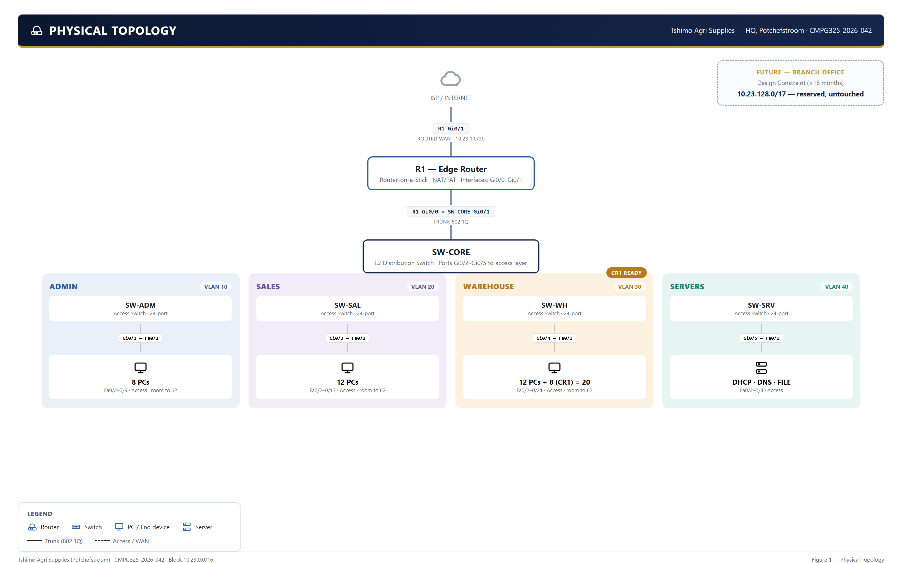

# 02 — Physical Topology

## Devices

| Device | Role | Model assumption |
|---|---|---|
| R1 | Edge router — router-on-a-stick, NAT/PAT to ISP | Cisco ISR (2901/4321-class) |
| SW-CORE | Core/distribution switch — 802.1Q trunking between R1 and access switches | Cisco 2960-class, 24-port |
| SW-ADM | Access switch — Admin/Management VLAN | Cisco 2960-class, 24-port |
| SW-SAL | Access switch — Sales VLAN | Cisco 2960-class, 24-port |
| SW-WH | Access switch — Warehouse/Logistics VLAN | Cisco 2960-class, 24-port |
| SW-SRV | Access switch — Server VLAN | Cisco 2960-class, 24-port |
| ISP router/cloud | Simulates the upstream Internet connection | Cisco router or PT Cloud object |

24-port access switches are specified even for the lowest-headcount department (Admin, 8 staff) so physical port capacity matches the logical address headroom built into every VLAN — see [`04 — IP Addressing Plan`](04-ip-addressing-plan.md). This means CR1-style headcount growth is a cabling exercise, not a hardware replacement.

## Cabling

- **R1 ↔ SW-CORE**: single trunk link (802.1Q), carries all VLAN sub-interface traffic
- **SW-CORE ↔ SW-ADM / SW-SAL / SW-WH / SW-SRV**: one trunk link per access switch
- **R1 ↔ ISP**: point-to-point WAN link, `10.23.1.0/30`
- **Access switches ↔ end devices**: access (untagged) ports, one VLAN per switch

## Interface plan (adjust to match the actual PT device model used)

| Device | Interface | Connects to | Mode |
|---|---|---|---|
| R1 | Gig0/0 (with sub-interfaces .10/.20/.30/.40/.99) | SW-CORE | Trunk (802.1Q) |
| R1 | Gig0/1 | ISP | Routed, `10.23.1.0/30` |
| SW-CORE | Gig0/1 | R1 | Trunk |
| SW-CORE | Gig0/2 | SW-ADM | Trunk |
| SW-CORE | Gig0/3 | SW-SAL | Trunk |
| SW-CORE | Gig0/4 | SW-WH | Trunk |
| SW-CORE | Gig0/5 | SW-SRV | Trunk |
| SW-ADM/SAL/WH/SRV | Fa0/1 | SW-CORE | Trunk (uplink) |
| SW-ADM/SAL/WH/SRV | Fa0/2–Fa0/24 | End devices / servers | Access |

Exact interface numbering will be confirmed once the devices are placed in Packet Tracer and recorded in `configs/` alongside the actual IOS command sets.

## Why a single core switch, not a collapsed router-switch pair per department

A flat, single-core design keeps the topology simple enough to reason about for an Advanced troubleshooting exercise (fewer hops to isolate a fault across) while still exercising the required skills: trunking, inter-VLAN routing, and a routed WAN edge. A larger, multi-core or redundant design was considered but rejected as unnecessary complexity for the client's size and out of scope for what the brief asks the topology to demonstrate.
