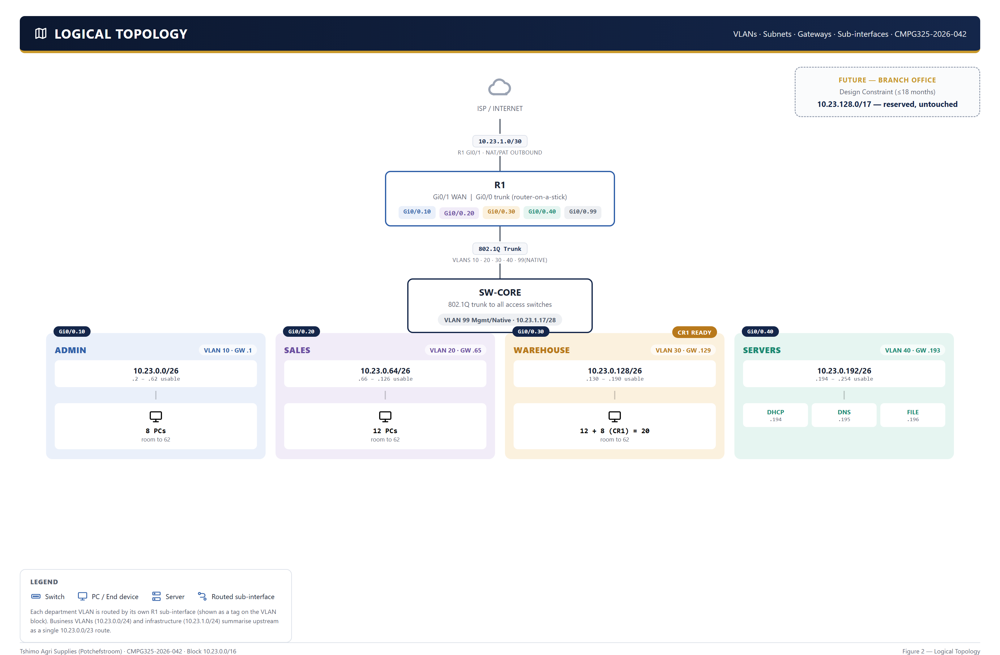

# 03 — Logical Topology

## VLANs

| VLAN | Name | Subnet | Gateway (on R1 sub-interface) |
|---|---|---|---|
| 10 | Admin/Management | `10.23.0.0/26` | `10.23.0.1` |
| 20 | Sales | `10.23.0.64/26` | `10.23.0.65` |
| 30 | Warehouse/Logistics | `10.23.0.128/26` | `10.23.0.129` |
| 40 | Servers | `10.23.0.192/26` | `10.23.0.193` |
| 99 | Mgmt/Native | `10.23.1.16/28` | `10.23.1.17` |

VLAN 99 is used as both the management VLAN (switch SVIs/remote access) and the trunk native VLAN, kept off VLAN 1 deliberately — leaving the default VLAN 1 unused for user traffic is standard practice and closes off an easy default-VLAN-hopping vector, which also matters for the fault-isolation scenario (a wrong native VLAN is one of the candidate faults — see `troubleshooting/`).

## Routing model

R1 performs inter-VLAN routing via **router-on-a-stick**: one physical trunk interface to SW-CORE, subdivided into one `802.1Q`-tagged sub-interface per VLAN, each holding that VLAN's gateway address. This was chosen over a Layer 3 switch because:

- It matches the CMPG 325 syllabus emphasis on router sub-interface configuration
- It keeps all routing configuration in one place (R1), which simplifies the troubleshooting scenario's blast radius
- Traffic volumes for a business this size do not require the throughput a dedicated L3 switch would provide

Inter-VLAN traffic (e.g. Sales querying the file server on VLAN 40) is routed by R1: in on one sub-interface, out on another. Traffic to the Internet is routed out R1's WAN interface and translated via NAT/PAT.

## Traffic flow examples

- **Admin PC → file server**: VLAN 10 access port → SW-ADM trunk uplink → SW-CORE → R1 trunk → routed VLAN 10 sub-int → VLAN 40 sub-int → SW-CORE → SW-SRV → server
- **Sales PC → Internet**: VLAN 20 access port → SW-CORE → R1 → NAT/PAT translation → ISP link
- **Any device → DHCP**: DHCP requests are relayed by R1 (`ip helper-address`, or DHCP served directly from R1 depending on final config) to the DHCP scope for that VLAN, hosted on the VLAN 40 server

## Trunking

Every switch-to-switch and switch-to-router link in this design is a trunk carrying VLANs 10, 20, 30, 40, and 99 (native). Only the final hop from an access switch to an end device or server is an untagged access port. See [`configs/`](../configs/) for the actual `switchport trunk allowed vlan` and `switchport mode access` commands per device.
